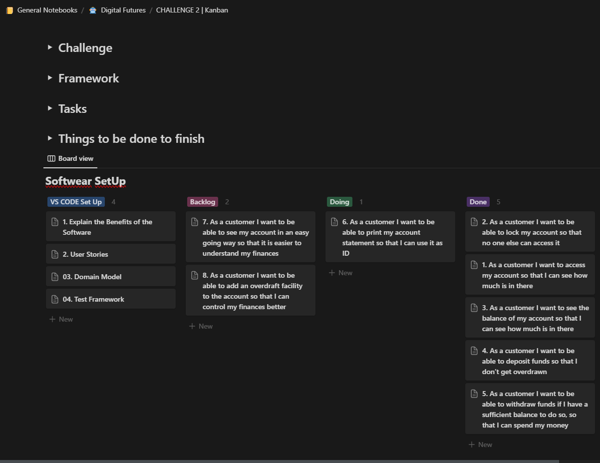
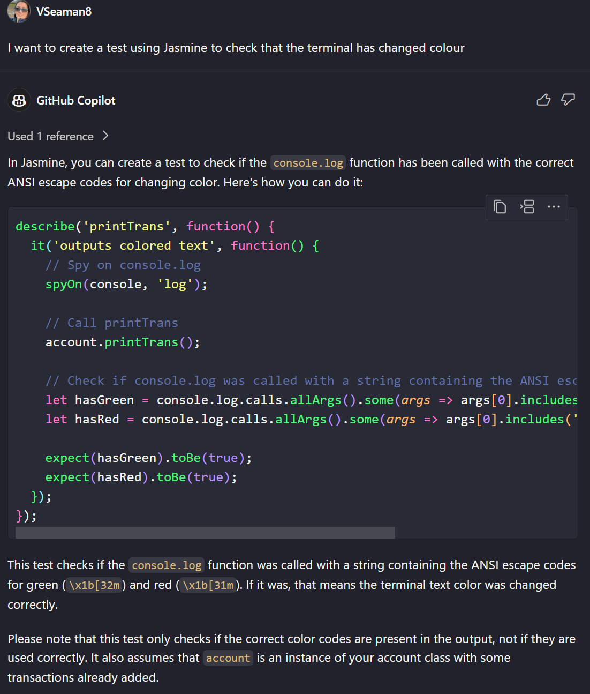

# Domain Models and Test Plan

### NB. To interact with the account through the user interface, please input '1234'. A demonstration of the account's functionality can be found under menu option 5.

# Contents

1. [User Stories and Domain Models](#user-stories-and-domain-models)
2. [Additional Features](#additional-features)
3. [Challenge Kanban](#screenshot-of-kanban-used-to-manage-challenge)
4. [AI Assist Information](#ai-assist-information)

# User Stories and Domain Models

### 1. As a customer I want to access my account so that I can see how much is in there

| Object  | Properties         | messages          | output   |
| ------- | ------------------ | ----------------- | -------- |
| account | isLocked @ Boolean | unlock (@integer) | @Boolean |
|         | pin @ integer      |                   |          |

#### Tests

1. Test 1: unlock should change the lock property to false when correct pin is entered
2. Test 2: Unlock doesn't effect lock property when incorrect pin is entered

---

### 2. As a Customer I want to be able to lock my account so that no one else can access it.

| Object  | Properties         | messages           | output   |
| ------- | ------------------ | ------------------ | -------- |
| account | isLocked @ Boolean | lockAcc (@integer) | @Boolean |
|         | pin @ integer      |                    |          |

#### Tests

1. Test 3: lockAcc method changes lock property from false to true

---

### 3. As a customer I want to see the balance of my account so that I can see how much is in there

| Object  | Properties             | messages                     | output   |
| ------- | ---------------------- | ---------------------------- | -------- |
| account | isLocked @ Boolean     | check_unlocked(@integer)     | @Boolean |
|         | CurrentBalance@ Number | addDeposit(@number, @String) |          |

#### Tests

1. Test 4: View currentBalance when account is unlocked

---

### 4. As a customer I want to be able to deposit funds so that I don’t get overdrawn

| Object      | Properties             | messages                     | output   |
| ----------- | ---------------------- | ---------------------------- | -------- |
| account     | isLocked @ Boolean     | check_unlocked(@integer)     | @Boolean |
|             | Pin @ integer          |                              |          |
|             | CurrentBalance@ Number | addDeposit(@number, @String) |          |
|             | transHist @ Array      |                              |          |
| Transaction | content @ string       |                              |          |
|             | amount @ float         |                              |          |
|             | date @ string          |                              |          |

#### Tests

1. Test 5: deposit adds entry to transaction when unlocked
2. Test 6: deposit doesn’t add to transaction when account is locked
3. Test 7: deposit can’t add a negative transaction
4. Test 8: Check currentBalance is correct when a deposit has been added

---

### 5. As a customer I want to be able to withdraw funds if I have a sufficient balance to do so, so that I can spend my money

| Object      | Properties             | messages                   | output   |
| ----------- | ---------------------- | -------------------------- | -------- |
| account     | isLocked @ Boolean     | check_unlocked(@integer)   | @Boolean |
|             | Pin @ integer          |                            |          |
|             | CurrentBalance@ Number | withdraw(@number, @String) |          |
|             | transHist @ Array      |                            |          |
| Transaction | content @ string       |                            |          |
|             | amount @ float         |                            |          |
|             | date @ string          |                            |          |

#### Tests

1. Test 9: withdraw adds entry to transaction when unlocked
2. Test 10: withdraw doesn’t add to transaction when account is locked
3. Test 11: withdraw can’t add a negative transaction
4. Test 12: check currentBalance is correct when a withdraw has been made
5. Test 15: Can't withdraw funds if there is not enough money in the account

---

### 6. As a customer I want to be able to print my account statement so that I can use it as ID

| Object      | Properties            | messages         | output   |
| ----------- | --------------------- | ---------------- | -------- |
| account     | isLocked @ Boolean    | check_unlocked() | @Boolean |
|             | CurrentBalance@ float | withdraw(@float) | @float   |
|             | TransHist @ Array     | printTrans()     | @array   |
| Transaction | content @ string      |                  |          |

#### Tests

1. Test 13: printTrans() prints correctly when account unlocked

---

# Additional Features

### 7. As a customer I want to be able to see my account in a simple easy to read format so that it is easier to understand my finances

| Object      | Properties             | messages                     | output   |
| ----------- | ---------------------- | ---------------------------- | -------- |
| account     | isLocked @ Boolean     | check_unlocked(@integer)     | @Boolean |
|             | CurrentBalance@ Number | addDeposit(@number, @String) |          |
|             |                        | withdraw(@number, @String)   |          |
|             | transHist @ Array      | printTrans()                 | @String  |
| Transaction | content @ string       |                              |          |
|             | amount @ float         |                              |          |
|             | date @ string          |                              |          |

#### Tests

1. Test 14: printTrans() prints coloured text

---

### 8. As a customer I want to be able to add an overdraft facility to the account so that I can control my finances better

| Object  | Properties             | Messages             | Output   |
| ------- | ---------------------- | -------------------- | -------- |
| Account | isLocked @ Boolean     | lockAcc (@integer)   | @Boolean |
|         | pin @ integer          |                      |          |
|         | overdraftLimit @ Float | addOverdraft(@Float) | @Float   |

Please note that this additional feature has not been added.

---

## Screenshot of Kanban used to manage Challenge

---

## AI Assist information

Co-Pilot was used to generate code to turn terminal text green or red. It was also used to generate a test to test this feature. See below screenshots for further information.

